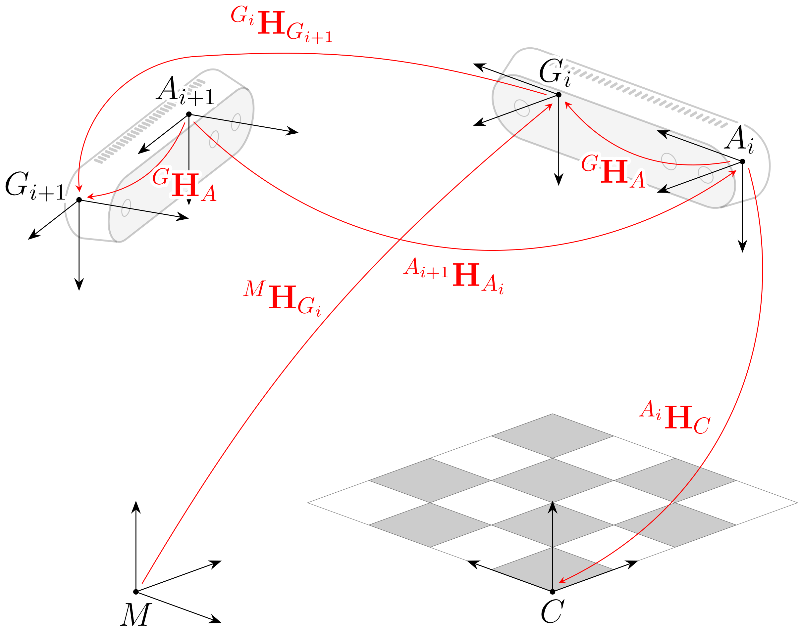

<div align="center">
<h1 align="center">
Camera Calibration
</h1>
</div>
<div align="center">
<h3>
<a href="https://www.maartenjongeneel.nl/">Maarten Jongeneel</a>
<br>
<br>
Extrinsic and Intrinsic camera calibration via OpenCV for poses obtained via OptiTrack Motion Capture system.
<br>
<br>
</h3>
</div>

# Requirements
 - MATLAB 2020a or later. 
 - Python 3
 - OpenCV package for python. Can be installed via
    ```cmd
    pip install opencv-python
    ```

# Introduction
This project contains the code for intrinsic and extrinsic camera calibration. The intrinsic calibration is done via OpenCV in Python and obtains also the checkerboard to camera poses. Then, using the OptiTrack data, a calibration is performed in Matlab to obtain the camera to casing pose.


Table of content
================
- [Installation](#installation)
- [Usage of the scripts](#usage-of-the-scripts)
- [Contact](#contact)


# Installation
You can clone this repository by opening a command window and typing
```cmd
git@github.com:MaartenJongeneel/CameraCalibration.git
```
# Usage of the scripts

1. Make sure you have the images (at least 10) of a checkerboard (with `.png` extension) placed in the ```data``` folder. The checkerboard should not be moved in between taking these images.
2. Make sure that for each of these images, you have the OptiTrack .csv Take files in the ```data``` folder, named in order equal to the order of your images. The OpitTrack data should be exported using quaternions as rotation parametrization and should contain at least one rigid body for which you are going to compute the extrinsic calibration.
3. In ```calibratecam.py```, change

    ```python
    sizex = 9
    sizey = 14
    sizes = 51.4 #size of one square in mm
    ```
    to the correct size of your checkerboard and the correct pattern (in this case 9x14 squares)
4. Run calibratecam.py by opening a terminal and running
    ```bash
    python calibratecam.py
    ```
    This will create the ```camera_poses.csv``` file containing the checkerboard-to-camera poses. The positions are stored in `[x y z]` coordinates in meters, the rotation is stored as a rotation vector in radians. It will also give you the intrinsics camera matrix, but this matrix is currently not stored anywhere.
5. Open Matlab, add the ```functions``` folder to your path, and change the lines
    ```matlab
    %Name of OptiTrack object (casing frame)
    ObjName = "RealSense002";
    ```
    to the correct name of the object you defined in OptiTrack (the casing frame).Then, run ```CalibrateCam.m```. This now gives you the matrix ```GH_A```, the transformation matrix from camera casing to camera sensor.
# Documentation
The camera is tracked using motion capture, where we assigned a frame to the camera casing. This frame (indicated by the letter G) does not coincide with the camera sensor frame (A) (see also Figure 2). To obtain this transformation, we perform an extrinsic calibration. Following the tutorial from [OpenCV](https://docs.opencv.org/4.x/dc/dbb/tutorial_py_calibration.html), we obtain the poses of the checkerboard w.r.t. the camera for each image using the script [calibratecam.py](/calibratecam.py). Since for each image, we also recorded the pose of the camera frame (G) w.r.t. a world frame using motion capture, we can solve an optimization problem to find the relative transformation between the camera casing frame (G) and the camera sensor frame (A). This optimization is based on the work of [[1](#references)] and [[2](#references)] and is incorporated in the script [CalibrateCam.m](/CalibrateCam.m) which can be run to reproduce the extrinsic calibration.

<div align="center">
    <div style = "display: flex; align="center">
         
    </div>
    <p>Figure 1: Overview of the extrinsic camera calibration.</p>
</div>

# Contact
For questions or suggestions, please send an email to [m.j.jongeneel@tue.nl](mailto:m.j.jongeneel@tue.nl).

# References
[1] R. Y. Tsai and R. K. Lenz, "A new technique for fully autonomous and efficient 3D robotics hand/eye calibration", in IEEE Transactions on Robotics and Automation, vol. 5, no. 3, pp. 345-358, June 1989, https://doi.org/10.1109/70.34770.

[2] F. C. Park and B. J. Martin, "Robot sensor calibration: solving AX=XB on the Euclidean group," in IEEE Transactions on Robotics and Automation, vol. 10, no. 5, pp. 717-721, Oct. 1994, doi: https://doi.org/10.1109/70.326576.